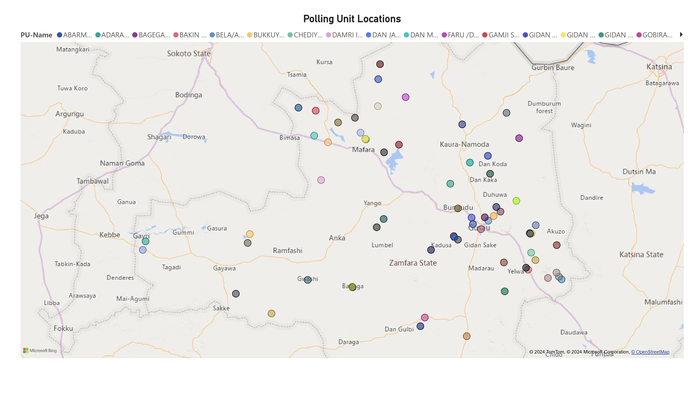

# Retail Sales Report


## Table of Contents
- [Project Overview](#project-overview)
- [Data Sources](#data-sources)
- [Tools](#tools)
- [Data Cleaning/Preparation](#data-cleaningpreparation)
- [Exploratory Data Analysis](#exploratory-data-analysis)
- [Data Analysis](#data-analysis)
- [Results/Findings](#resultsfindings)
- [Limitations](#limitations)

### Project Overview
---
Ensuring free and fair elections is fundamental to a functioning democracy. Data analysis, particularly geospatial analysis, offers a powerful tool to safeguard electoral integrity. This project, undertaken as part of Stage 1 of the HNG Internship, focused on detecting outliers in the 2023 Nigerian election data for Zamfara State using advanced spatial analysis methods.

The challenge lies in identifying subtle anomalies in voting patterns that might indicate voter fraud. To address this, we leveraged the capabilities of Python for data manipulation and implemented the DBSCAN clustering algorithm. This algorithm excels at pinpointing geographically anomalous clusters, potentially revealing irregularities such as ballot stuffing or voter suppression.

By analyzing data from the 'ZAMFARA_crosschecked.csv' file, which contained information on polling units, we aimed to extract and validate their geographic coordinates. This validation process ensured the accuracy of our analysis. We then utilized the DBSCAN algorithm to group polling units exhibiting similar spatial voting patterns. Deviations from these expected patterns could signal potential irregularities.

### Data Sources

The project leverages a dataset provided by HNG tech, ZAMFARA_crosschecked.csv, the file has 19 Columns and 71 rows, for our analysis, we focused on the following columns, State, LGA, Ward, PU-Name, APC, LP, PDP and NNPP.


### Tools
  - Google Sheets - Univariate Analysis, Data Analysis and Geocoding
  - Microsoft PowerBI - Data Visualization
  - Power Query - Data Processing and Preparation
 
### Data Cleaning/Preparation

In the data preparation phase, we performed the following tasks:
1. Data loading and inspection
2. Data cleaning and formatting

### Exploratory Data Analysis

EDA involved exploring the datasets to answer key questions such as:
- Distribution of polling units across Zamfara State
- Identification of potential geographic outliers
- Patterns in voter turnout and party performance
- Correlation between spatial location and voting results
- Anomalies in voting patterns that could indicate irregularities

### Data Analysis
- Extracted and validated geographic coordinates from the 'ZAMFARA_crosschecked.csv' file
- Implemented the DBSCAN clustering algorithm to group polling units based on spatial proximity
- Identified 17 distinct clusters of polling units within a 20-mile radius
```py
import pandas as pd
import numpy as np
from geopy.distance import great_circle
from sklearn.cluster import DBSCAN

# Load data
file_path = '/content/ZAMFARA_crosschecked_ward.csv'
data = pd.read_csv(file_path)
data.head() # this is to show you the dataset

# Extract geographic coordinates
coords = data[['Latitude', 'Longitude']].values

# Apply DBSCAN for clustering (eps in radians, 20 km ~ 1/6371 rad)
kms_per_radian = 6371.0088
epsilon = 20 / kms_per_radian # 20KM radius
db = DBSCAN(eps=epsilon, min_samples=1, algorithm='ball_tree', metric='haversine').fit(np.radians(coords))

# Add cluster labels to the original data
data['Cluster'] = db.labels_

# Save the result
output_file = 'Zamfara_crosschecked_clustered.csv'
data.to_csv(output_file, index=False)
```

- Applied Z-score analysis to identify potential outliers in voting data
- Used a threshold of +/- 2 standard deviations to flag anomalies
- Calculated and compared deviations in voting patterns for different political parties

```F#
=IFERROR((PartyVote - PartyMean)/PartyS.D, 0)
```
- Analyzed the significance of outliers in specific clusters (e.g., Clusters 3, 1, and 13)
- Provided detailed breakdowns of polling units with the highest outlier values for each party
-  Identified the top 3 polling units with the highest deviations across all parties
- Compared anomalies across different political parties (APC, LP, PDP, NNPP)

### Results/Findings
- Identified 11 statistical outliers using Z-score analysis (threshold: +/- 2 standard deviations).
- Applied DBSCAN algorithm, grouping polling units into 17 distinct clusters within a 20-mile radius.
- Observed a notable concentration of outliers in clusters 3, 1, and 13, suggesting potential geographical anomalies in voting patterns.
- APC: MADAMBAJI / GARKAR HAKIMI (deviation score: ~2.62)
- LP: GIDAN KARA / DAN HILI (highest overall deviation score: 4, Cluster 3)
- PDP: MADACCI II/ADULT EDU. CLASS (deviation score: ~3.44, Cluster 1)
- First polling unit in its cluster to achieve a three-digit vote count (204 votes).
- NNPP: SABON GARI I / MADA GENERAL HOSPITAL (deviation score: ~3.83, Cluster 3)
- The distribution of outliers across different clusters suggests potential geographical patterns in voting irregularities.
- The limited size of the dataset may have influenced the distribution and number of outliers detected.
- Demonstrated the effectiveness of combining statistical techniques (Z-scores) with geospatial analysis (DBSCAN clustering) for comprehensive detection of potential electoral irregularities.

### Conclusion
This project successfully demonstrated the power of combining geospatial analysis with statistical techniques to detect potential voter fraud in the 2023 Nigerian election data for Zamfara State. By employing Z-score analysis and the DBSCAN clustering algorithm, we identified 11 significant outliers across 17 distinct spatial clusters. Key anomalies were pinpointed in specific polling units, particularly within clusters 3, 1, and 13, suggesting geographical patterns in voting irregularities. The analysis revealed notable deviations in voting patterns for different political parties, with the highest observed in the LP party at GIDAN KARA / DAN HILI. While the limited dataset size may have influenced our findings, this multi-faceted approach proved effective in highlighting areas that warrant further investigation. The project underscores the value of data-driven methods in enhancing election transparency and integrity, paving the way for more robust electoral processes in Nigeria's democratic system.

### Limitations
This study, while insightful, faced several limitations that should be considered when interpreting the results. Firstly, the analysis relied on a limited dataset, which may have affected the detection and distribution of outliers. A larger, more comprehensive dataset could potentially reveal additional patterns or anomalies. Secondly, the DBSCAN algorithm's effectiveness is sensitive to parameter choices, particularly the epsilon value, which could influence cluster formation. The study also lacked historical voting data for comparison, which could have provided context for identifying unusual voting patterns. Additionally, the analysis did not account for potential confounding factors such as demographic shifts, local political dynamics, or changes in polling unit locations. Finally, while statistical and geospatial methods can flag potential irregularities, they cannot definitively prove fraud without further investigation. These limitations highlight the need for cautious interpretation and suggest areas for improvement in future electoral data analyses.
